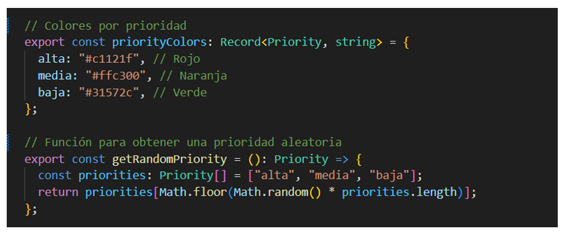
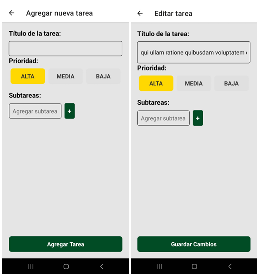
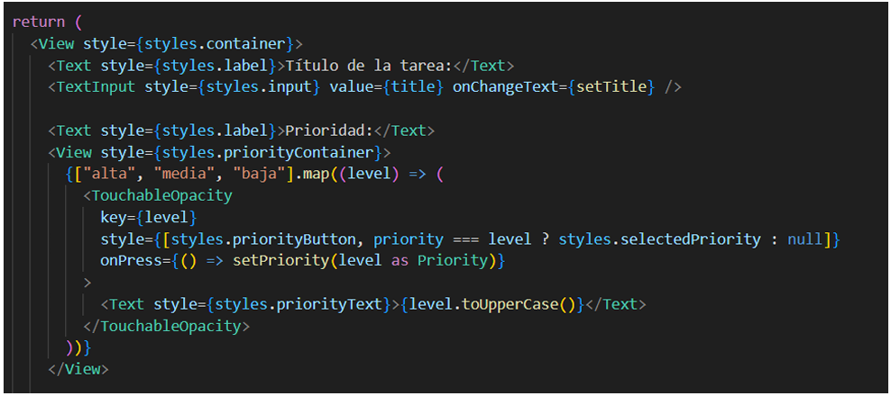
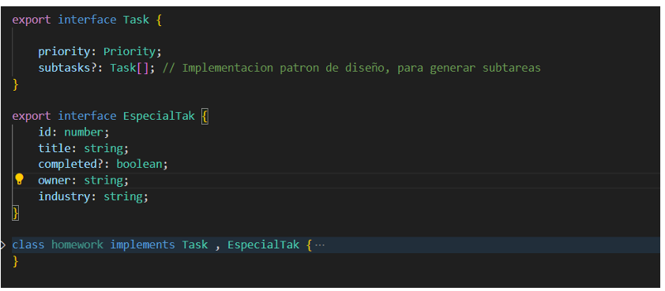
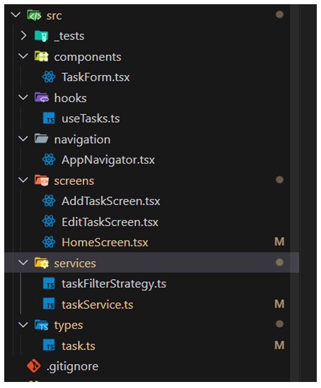
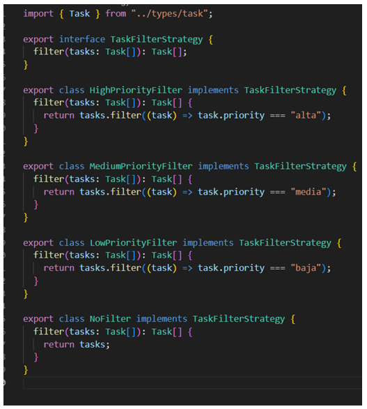
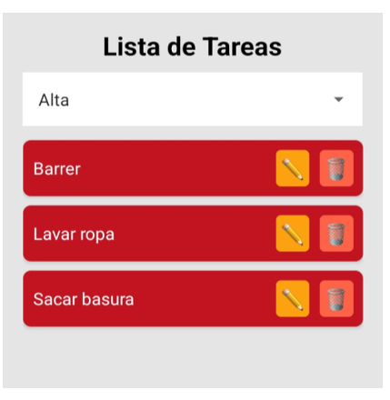
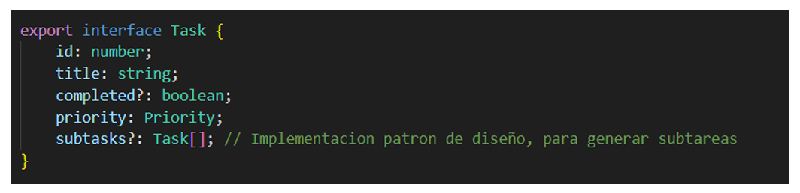
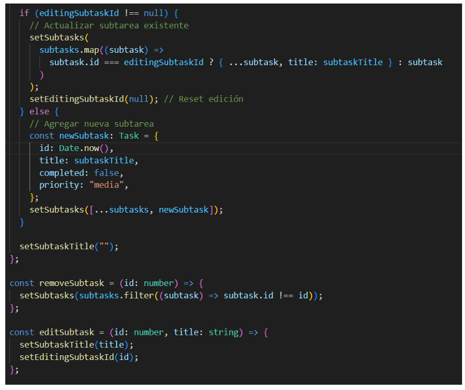
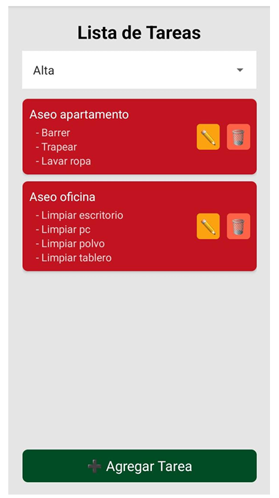

# Prueba Técnica - React Native

## Autor
**David Fernando Bañol Posada**

## Empresa
**Imaginamos**

## Año
**2025**

## Selección de colores y relación con las prioridades
Para mejorar la experiencia del usuario y facilitar la visualización de las tareas según su importancia, se definieron colores específicos para cada nivel de prioridad:

- **Alta prioridad**: Rojo (#c1121f)
- **Media prioridad**: Naranja (#ffc300)
- **Baja prioridad**: Verde (#31572c)

La prioridad se asigna de dos maneras:

1. De manera aleatoria al traer tareas desde la API pública **JSONPlaceholder**.

2. Mediante la creación o edición de tareas desde la interfaz de usuario.

## Aplicación de principios SOLID
### Principio de Segregación de Interfaces
Se definió una interfaz para las tareas a ejecutar. Si el proyecto requiere una tarea con características diferentes a título y prioridad, podrá desprenderse fácilmente de la interfaz de `Task` y sus clases derivadas.

### Principio de Responsabilidad Única
Se separó la lógica del negocio de la UI, organizando la aplicación en:
- **Screens**
- **Servicios**
- **Hooks**

Por ejemplo, `HomeScreen` solo se encarga del proceso de UI, sin manejar la lógica de negocio.

## Implementación de Patrones de Diseño
### Strategy
Se implementó el patrón **Strategy** para permitir diferentes estrategias de filtrado sin modificar la lógica central. Esto permite filtrar tareas por prioridad de manera flexible.

Permitiendo crear filtros por prioridad

### Composite
Se implementó el patrón **Composite** para manejar la jerarquía de tareas y subtareas. Esto permite:
- Editar tareas y subtareas.
- Eliminar tareas y subtareas.
- Agregar tareas y subtareas dentro de tareas principales ya existentes o nuevas.

